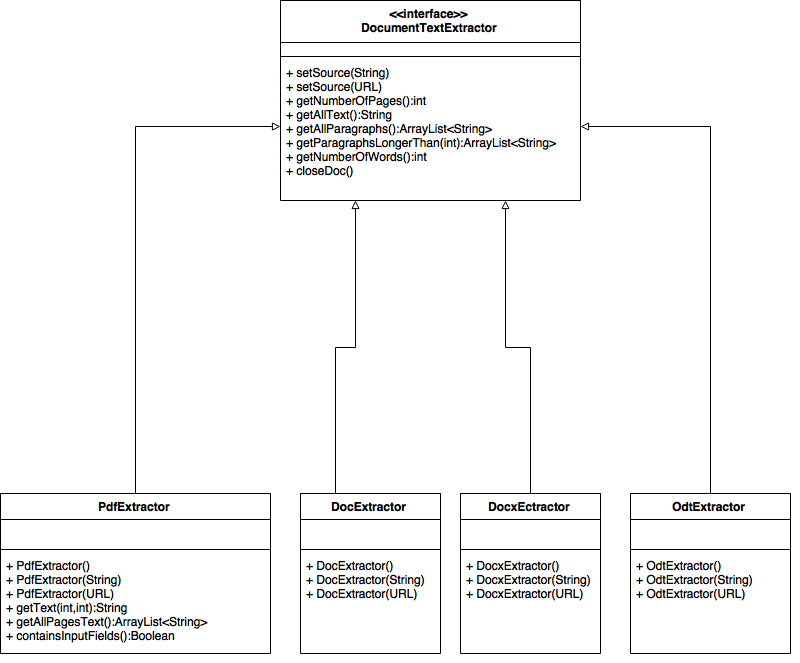

#DocumentTextExtractor
##Klassediagram

###+
I tillegg til metodane over, inneheld grensesnittet òg
* `int getCreationYear()`
	* Returnerer året dokumentet vart oppretta, dersom det ligg informasjon om dette i dokumentet sine metadata.
* `boolean isForm()`
	* Returnerer `true` for alle format som kan endrast av brukar, bortsett frå pdf-filer utan skjemaelement i seg. 

##PdfExtractor
Konstanten `DEFAULT_DROP_THRESHOLD` bestemmer kor langt unna eit grafisk element må vere eit anna for at det skal reknast som å vere frå same avsnitt. Ein verdi som fungerte bra for dei fleste tilfelle var 3, men denne kan justerast om avsnitt blir for korte/lange for ei stor mengd dokument.

`SPLIT_STRING` er ein konstant som blir nytta i tilfelle der ein vil ha ut tekst oppdelt på sider eller avsnitt, og var krevd av biblioteket for at desse funksjonane skulle fungere. Må vere unik nok til at den ikkje førekjem i dei faktiske dokumenta.

##TextExtractor
Denne klassen tek inn filplasseringar som `String`, og ein `ElasticConnector` i konstruktør. Denne instansierer så eit `DocumentObject` som deretter inneheld denne filplasseringa og namn på eigar av data (etat). Sistnemnde blir henta ut frå `ElasticConnector`.

`handleFile(DocumentObject o)` er ein svær metode som 
* instansierer rett DocumentExtractor alt etter filtype og printar ein error om filformatet ikkje er støtta
* opnar fila. Her må filplasseringa anten vere ein url som startar med `http://` eller `https://` eller vere lagra lokalt. Akkurat no blir berre dokument frå Internett henta. Men det er mogleg å lage f.eks. ei mappe med filer, og gå gjennom desse v.h.a. `walk(String path)`, leggje alle desse inn i ein `DocumentObject` og handtere dei vha `HandleFile()`.
* hentar ut tekst i form av ein `ArrayList<String>` som inneheld avsnitt.
* gjenkjenner språket i kvart avsnitt og bestemmer det dominerande språket i dokumentet ut frå delspråka.  
* skriv dataa til `ElasticConnector`.

###Grensetilfelle
####Ugyldige sertifikat
På grunn av store problem med store mengder sider med ugyldige SSL-sertifikat, som resulterte i at filer ikkje kunne bli leste, er det i `Setup.java` no satt til **at alle SSL-sertifikat er godkjende** i `initiateTrustManager()`. Kanskje ikkje så lurt, og burde ordnast på ein annan måte.
####404 og redirecting til txt/html
Mange nettsider har utdaterte lenkjer til filer, som ofte redirectar til dokument av typen `text/html`. Dette blir no handtert i `handleFile()`, men om ein vil kan ein leggje det til i database og føre statistikk på øydelagde lenkjer.